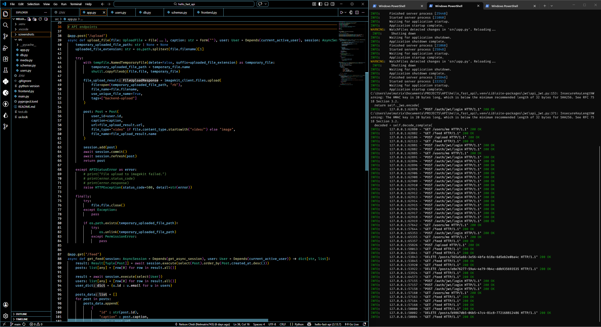
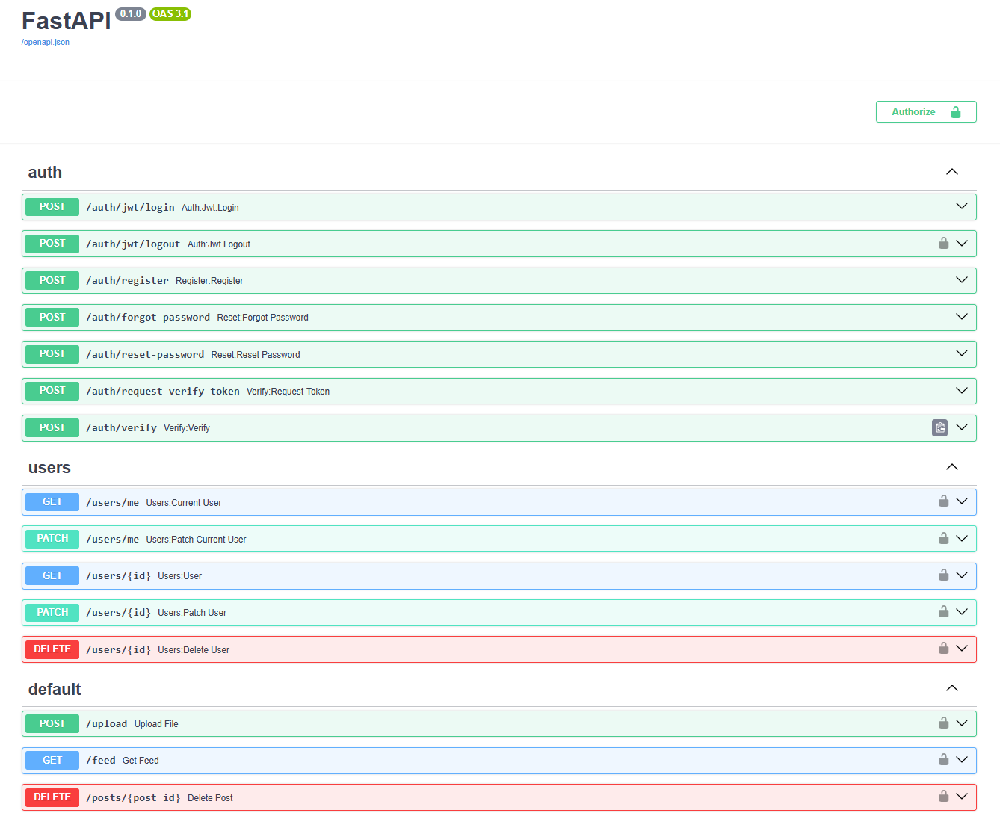
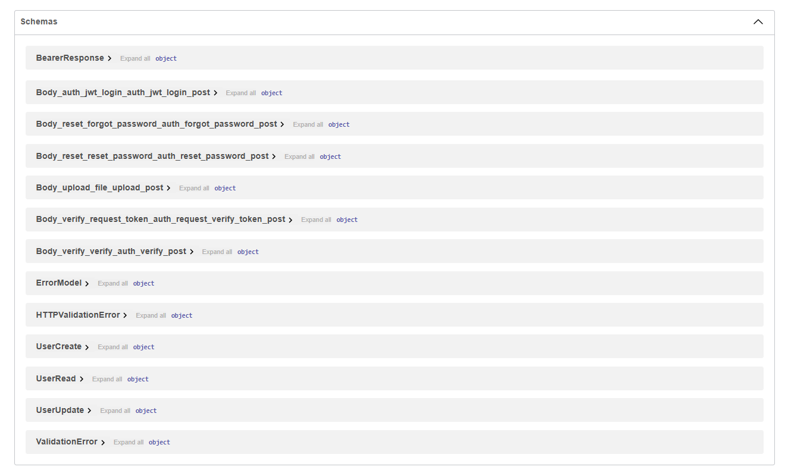

# HELLO FAST API

This is a beginner **FastAPI** project I worked on, which is primarily focused on providing me with hands-on experience with the FastAPI framework. Building this project helped me explore the core aspects of FastAPI, including:

- Defining and implementing API endpoints/routes.
- Writing code logic to handle different HTTP request messages for each API endpoint.
- Implementing user authentication, registration, and authorization flows.
- Working with various HTTP methods.
- Connecting the backend to a pre-written **Streamlit** frontend for testing the API in real use cases.
- Integrating the backend with external services, such as **ImageKit.io**.

Overall, this was an educational and enjoyable project to work on. More **FastAPI-based** projects are planned for the near future.

---
  

  

  

---
MIT LICENSE  

---